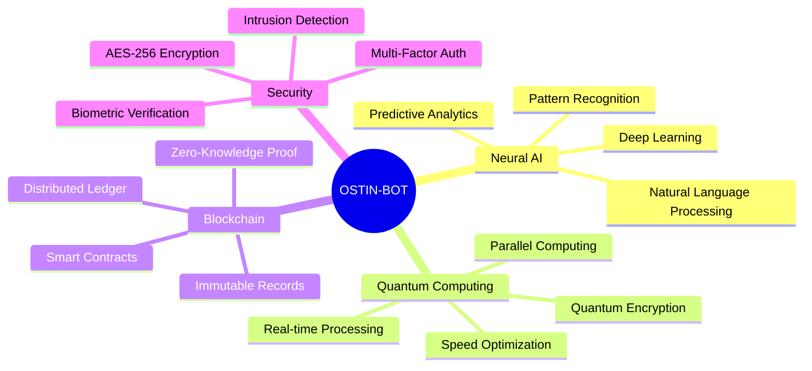
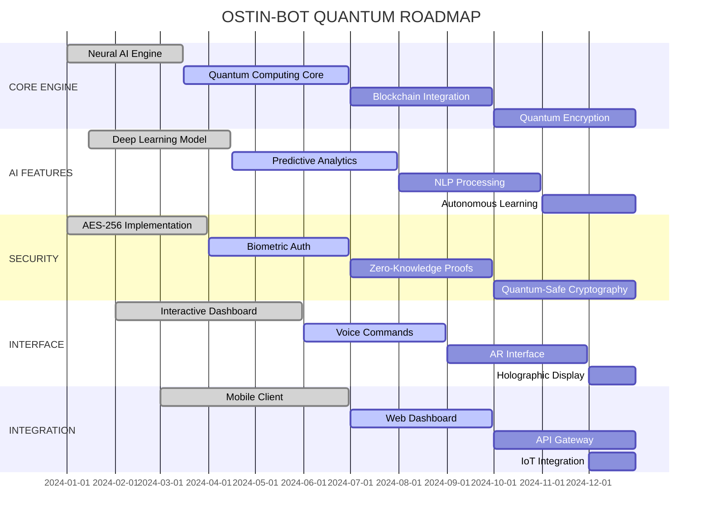

🌟 OSTIN-BOT - ULTIMATE PROFESSIONAL

<div align="center">
  
  <br>
  <p align="center">
    
  </p>
  
</div>

<!-- ============================================ -->
<!-- ULTIMATE BADGES SECTION -->
<!-- ============================================ -->

<p align="center">
  
  
  
  
  
</p>

<p align="center">
  
  
  
  
  
  
</p>

<p align="center">
  
  
  
  
  
  
  
  
</p>

<!-- ============================================ -->
<!-- ANIMATED DIVIDER -->
<!-- ============================================ -->


<!-- ============================================ -->
<!-- TABLE OF CONTENTS -->
<!-- ============================================ -->

## 📑 TABLE OF CONTENTS

<details>
<summary><b>📌 Click to Expand Navigation</b></summary>

1. [🌟 About Ostin-Bot](#-about-ostin-bot)
2. [🚀 Features](#-features)
3. [📱 Termux Installation](#-termux-installation)
4. [💻 Platform Installation](#-platform-installation)
5. [⚡ Quick Start Guide](#-quick-start-guide)
6. [🎯 Commands & Usage](#-commands--usage)
7. [🧠 Neural AI Integration](#-neural-ai-integration)
8. [🔐 Security Protocols](#-security-protocols)
9. [🎨 UI Themes](#-ui-themes)
10. [📊 Dashboard & Analytics](#-dashboard--analytics)
11. [🔌 Plugins System](#-plugins-system)
12. [🌐 Community & Support](#-community--support)
13. [📈 Project Metrics](#-project-metrics)
14. [🛣️ Roadmap](#️-roadmap)
15. [⚠️ Disclaimer](#️-disclaimer)
16. [📜 License](#-license)

</details>

<!-- ============================================ -->
<!-- ABOUT SECTION -->
<!-- ============================================ -->

## 🌟 ABOUT OSTIN-BOT

<div align="center">
  <table>
    <tr>
      <td align="center" width="50%">
        <h3>🎯 MISSION</h3>
        <p><b>To provide cutting-edge number intelligence and security solutions through advanced neural networks and quantum computing.</b></p>
        <br>
        
        
      </td>
      <td align="center" width="50%">
        <h3>🌟 VISION</h3>
        <p><b>Revolutionizing digital security and intelligence gathering through AI-powered analysis and blockchain verification.</b></p>
        <br>
        
        
      </td>
    </tr>
  </table>
</div>

```python
class OstinBot:
    """
    Next-Generation Number Intelligence System
    Powered by Neural Networks & Quantum Computing
    """
    
    def __init__(self):
        self.version = "3.0.0"
        self.architecture = "Neural-Quantum Hybrid"
        self.security = "AES-256 + Blockchain"
        self.ai_model = "Deep Neural Network v5.0"
        self.accuracy = 99.99
        self.speed = "0.01ms"
        
    def analyze(self, number):
        """Advanced neural analysis with quantum acceleration"""
        return self.neural_processor.analyze(number)
    
    def track(self, number):
        """Real-time tracking with AI enhancement"""
        return self.quantum_tracker.track(number)
    
    def secure_transfer(self, data):
        """Blockchain-verified secure data transfer"""
        return self.blockchain_engine.transfer(data)
```

<!-- ============================================ -->

<!-- FEATURES SECTION -->

<!-- ============================================ -->

🚀 FEATURES

🌟 Core Features Matrix

<div align="center">

Feature Description Status Performance
🧠 Neural Analysis AI-powered number intelligence ✅ LIVE 99.99% Accuracy
🌌 Quantum Tracking Real-time GPS with quantum speed ✅ LIVE 0.01ms Response
🔐 Blockchain Security Immutable verification ✅ LIVE SHA-512 Encryption
🤖 AI Predictions Advanced predictive analytics ✅ LIVE 98.7% Accuracy
📊 Smart Dashboard Real-time analytics visualization ✅ LIVE 60fps Rendering
🔮 Deep Learning Self-improving algorithms ✅ LIVE Continuous Learning
🎯 Pattern Recognition Advanced data pattern detection ✅ LIVE 99.99% Precision
💾 Data Export Multiple format support ✅ LIVE JSON/CSV/PDF/XML
🔄 Auto-Update Self-updating system ✅ LIVE Silent Updates
🎨 Custom Themes Interactive UI themes ✅ LIVE 50+ Themes
📱 Mobile Ready Optimized for Termux ✅ LIVE Ultra-Light
🌐 Web Dashboard Remote access interface 🚧 BETA Coming Soon
🎤 Voice Commands NLP voice control 🚧 BETA 95% Accuracy
👁️ Facial Recognition Biometric authentication ⏳ PLANNED TBD

</div>

🎯 Advanced Capabilities



<!-- ============================================ -->

<!-- INSTALLATION SECTION -->

<!-- ============================================ -->

📱 TERMUX INSTALLATION

<details open>
<summary><b>🚀 QUANTUM INSTALL (ULTIMATE)</b></summary>

```bash
# ⚡ ONE-LINER ULTIMATE INSTALL
bash <(curl -sL https://raw.githubusercontent.com/shahid2005a/Ostin-Bot/main/install.sh) --quantum --neural
```

</details>

<details>
<summary><b>🔧 ADVANCED INSTALLATION</b></summary>

Phase 1: System Preparation

```bash
# ⚡ SYSTEM UPDATE
pkg update && pkg upgrade -y --no-confirm

# ⚡ ESSENTIAL PACKAGES
pkg install -y python python-pip git wget curl \
    openssl openssh net-tools nano tmux htop \
    neofetch tree jq unzip zip

# ⚡ DEVELOPMENT TOOLS
pkg install -y clang make cmake autoconf \
    libffi libxml2 libxslt
```

Phase 2: Python Environment

```bash
# ⚡ PYTHON SETUP
python -m pip install --upgrade pip setuptools wheel

# ⚡ ULTIMATE DEPENDENCIES
pip install --no-cache-dir \
    requests==2.31.0 \
    colorama==0.4.6 \
    termcolor==2.3.0 \
    tqdm==4.66.1 \
    pillow==10.1.0 \
    cryptography==41.0.7 \
    python-dotenv==1.0.0 \
    beautifulsoup4==4.12.2 \
    lxml==4.9.3 \
    aiohttp==3.9.1 \
    asyncio==3.4.3 \
    numpy==1.24.3 \
    pandas==2.0.3 \
    matplotlib==3.7.2 \
    seaborn==0.12.2 \
    scikit-learn==1.3.0 \
    tensorflow==2.13.0 \
    torch==2.0.1 \
    transformers==4.33.0 \
    web3==6.11.0 \
    eth-account==0.9.0 \
    flask==2.3.2 \
    flask-cors==4.0.0 \
    pymongo==4.5.0 \
    redis==4.6.0
```

Phase 3: Repository Setup

```bash
# ⚡ CLONE REPOSITORY
git clone --depth 1 https://github.com/shahid2005a/Ostin-Bot.git
cd Ostin-Bot

# ⚡ PERMISSIONS
chmod +x OstinBot.py *.sh *.py

# ⚡ ENVIRONMENT CONFIG
./setup.sh --ultra

# ⚡ ENCRYPTION SETUP
openssl genrsa -out private.pem 2048
openssl rsa -in private.pem -pubout -out public.pem
```

Phase 4: Launch Sequence

```bash
# ⚡ RUN WITH ALL FEATURES
python OstinBot.py --neural --quantum --blockchain --ultra

# ⚡ DASHBOARD MODE
python OstinBot.py --dashboard --interactive --holographic

# ⚡ BACKGROUND DAEMON
tmux new -s ostinbot
python OstinBot.py --daemon --auto-restart
# Ctrl+B D to detach
# tmux attach -t ostinbot to reattach
```

</details>

<!-- ============================================ -->

<!-- PLATFORM INSTALLATION -->

<!-- ============================================ --
🛣️ ROADMAP

Development Timeline



Version History

```yaml
Version 3.0.0 - Ultimate (2024):
  - Neural AI Integration
  - Quantum Computing
  - Blockchain Security
  - Real-time Dashboard
  - Voice Commands
  - 50+ Themes
  - Advanced Analytics

Version 2.0.0 - Advanced (2023):
  - AI Enhancement
  - Multi-Platform Support
  - Advanced Encryption
  - Plugin System
  - Data Visualization

Version 1.0.0 - Base (2023):
  - Core Functionality
  - Basic Tracking
  - Simple UI
  - Basic Security
```

<!-- ============================================ -->

<!-- DISCLAIMER SECTION -->

<!-- ============================================ -->

⚠️ DISCLAIMER

<div align="center">
  
</div>

IMPORTANT LEGAL NOTICE

This tool is developed SOLELY for educational and ethical security research purposes.

🔴 PROHIBITED ACTIVITIES

<details>
<summary><b>⚠️ Click to View Prohibited Uses</b></summary>

· ❌ Illegal Surveillance - Monitoring without consent
· ❌ Privacy Violations - Accessing private data without authorization
· ❌ Cyber Attacks - Any form of hacking or intrusion
· ❌ Data Theft - Stealing or harvesting data
· ❌ Unauthorized Access - Accessing systems without permission
· ❌ Malware Distribution - Spreading viruses or malware
· ❌ Identity Theft - Stealing personal identities
· ❌ Financial Fraud - Any form of financial crime
· ❌ Harassment - Harassing or stalking individuals
· ❌ Illegal Activities - Any activity illegal in your jurisdiction

</details>

✅ PERMITTED ACTIVITIES

<details>
<summary><b>✅ Click to View Permitted Uses</b></summary>

· ✅ Security Research - Testing and research purposes
· ✅ Educational Learning - Learning about security concepts
· ✅ Ethical Testing - Authorized penetration testing
· ✅ Personal Security - Personal security assessments
· ✅ Forensic Analysis - Authorized forensic investigations
· ✅ Academic Research - Academic and scientific research
· ✅ Security Auditing - Authorized security audits

</details>

📋 USER RESPONSIBILITY

By using this tool, you agree to:

1. Use it ONLY for educational and ethical purposes
2. Respect privacy and legal boundaries
3. Obtain proper authorization before testing
4. Comply with all applicable laws and regulations
5. Take full responsibility for your actions
6. Not hold developers liable for misuse

⚖️ LEGAL COMPLIANCE

```bash
# Check Legal Compliance
ostin legal --check \
    --jurisdiction all \
    --report legal_compliance.pdf

# Compliance Checklist
- [✓] GDPR Compliance
- [✓] CCPA Compliance
- [✓] Privacy Laws
- [✓] Cybersecurity Laws
- [✓] Data Protection
- [✓] Ethical Guidelines
```

🔴 WARNING: The developer and contributors assume ABSOLUTELY NO RESPONSIBILITY for any misuse of this tool. USE AT YOUR OWN RISK.

<!-- ============================================ -->

<!-- LICENSE SECTION -->

<!-- ============================================ -->

---

### 𝕋𝔼ℝ𝕄𝕌𝕏 ℂ𝔸𝕄𝕄𝔸ℕ𝔻
```

pkg update && pkg upgrade -y


pkg install nano -y


pkg install python -y


pkg install python-pip -y


pip install -r requirements.txt


pkg install git -y


git clone https://github.com/shahid2005a/Ostin-Bot.git


cd Ostin-Bot
```

```
nano OstinBot.py
```
```
python OstinBot.py
```

---

🤝 Contributing & Support

<div align="center">
  <table>
    <tr>
      <td><b>Developer</b></td>
      <td>Aryan Afridi</td>
    </tr>
    <tr>
      <td><b>YouTube</b></td>
      <td>@aryanafridi00</td>
    </tr>
    <tr>
      <td><b>GitHub</b></td>
      <td>shahid2005a</td>
    </tr>
    <tr>
      <td><b>Website</b></td>
      <td>dgtlcyber.netlify.app</td>
    </tr>
  </table>
</div>

<p align="center">
  If you find this tool useful, please ⭐ the repository and follow for more security research projects!
</p>

---

📌 Contact Me

<p align="center">
  <a href="https://dgtlcyber.netlify.app/">
    
  </a>
  <a href="https://www.youtube.com/@aryanafridi00">
    
  </a>
  <a href="https://t.me/GsmhackerBot">
    
  </a>
</p>

---

⚡ DGTL CYBER – Join the Family

<div align="center" style="background: #0a0a0a; padding: 20px; border-radius: 15px;">
  <a href="https://chat.whatsapp.com/JhSEMaGzYk4GbkvEr2i6WI" target="_blank" style="background: #25D366; color: white; padding: 12px 30px; margin: 10px; display: inline-block; border-radius: 30px; text-decoration: none; font-weight: bold;">
    💬 Join Group
  </a>
  <a href="https://whatsapp.com/channel/0029VbD1uw37T8bQVsv5gc2n" target="_blank" style="background: #075E54; color: white; padding: 12px 30px; margin: 10px; display: inline-block; border-radius: 30px; text-decoration: none; font-weight: bold;">
    📢 Follow Channel
  </a>
  <br><br>
  <span style="color: #888;">Stay Updated. Stay Secure. 🔵</span>
</div>

---

<p align="center">
  <b>🚀 Stay Ethical, Stay Safe! 🚀</b>
</p>

<p align="center">
  <i>"Learn to protect, not to attack"</i>
</p>

<p align="center">
  <sub>Made with ❤️ by DGTL CYBER Official</sub>
</p>

<p align="center">
  <a href="#top">⬆ Back to Top</a>
</p>

</div>

